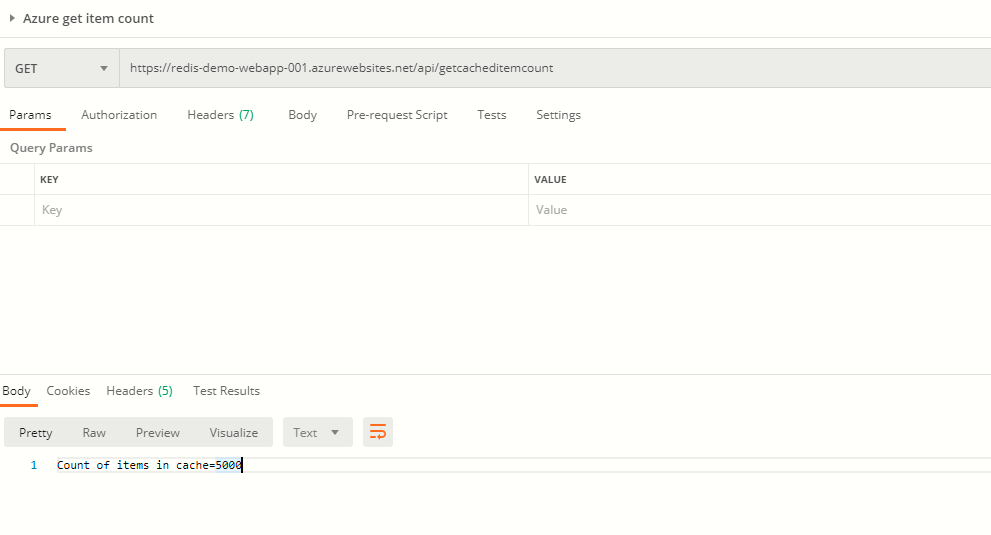

# About this project
Demonstrates how to use Redis Cache from a .NET Core Azure function app

# Accompanying article
This code accompanies the aricle I wrote here [LINK TO BE ADDED]

# What does this SOLUTION contain?
## Azure function (HTTP trigger)
- FunctionApp1.csproj
- This implements a few HTTP end points which interact with Redis

## Some basic unit tests
- UnitTestProject1.csproj
- Less of unit testing and more to demonstrate various code snippets

## Deployment
- PowerShell scripts for infrastructure deployment (App service plan, app, redis cache, app insight)
- ARM template
 

# How to create the Azure resources and deploy your code?
- You will need an Azure subscription
- Ensure you have PowerShell and the Az modules installed
- Once installed ensure you have done a login from PowerShell via `Connect-AzAccount`
- If you run `Get-AzSubscription` then you should see teh subscriptions available to you
- Launch a PowerShell console and navigate to the Deployment project and run CreateAzureResources.ps1
- Wait for the script to complete. Deploying Redis Cache can take up to 30 minutes.
- Once done, you will now have to compile and upload your Function app binaries to the new App Service that you just created in the previous step
- Run the script UploadToAzure.ps1. You should run this script from a PowerShell console which is able to run `dotnet` cmdline exe

# How to test the deployment succeeded?
## Visual inspection
- You should see a new resource group rg-dev-redis-demo
- You can use Postman to fire the HTTP end points as shown below

## What are the various HTTP end points
- BulkAddCustomers: [POST] https://localhost:7071/api/bulkadd
- FlushCache: [POST] http://localhost:7071/api/flushcache
- GetCachedItemCount: [GET] http://localhost:7071/api/getcacheditemcount
- GetItem: [GET] http://localhost:7071/api/getitem
- Ping: [GET] http://localhost:7071/api/ping
- simpleping: [GET] http://localhost:7071/api/simpleping
- Benchmark: [POST] http://localhost:7071/api/benchmark
